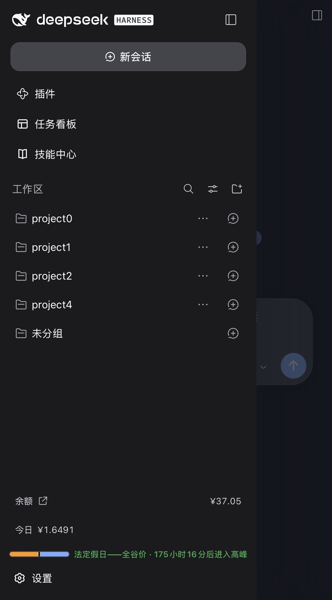
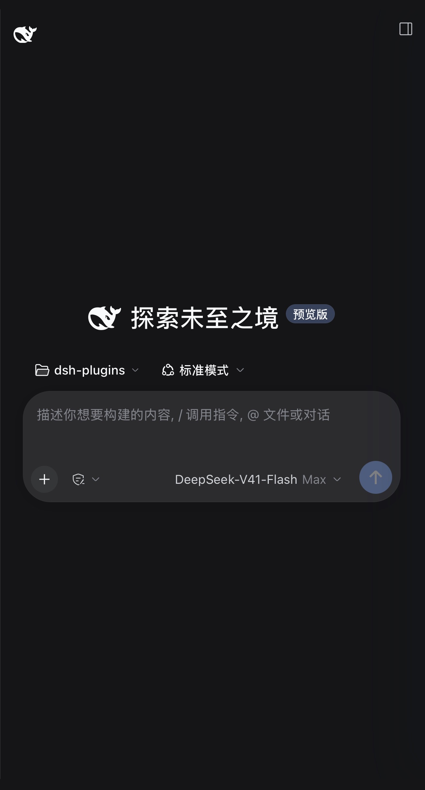
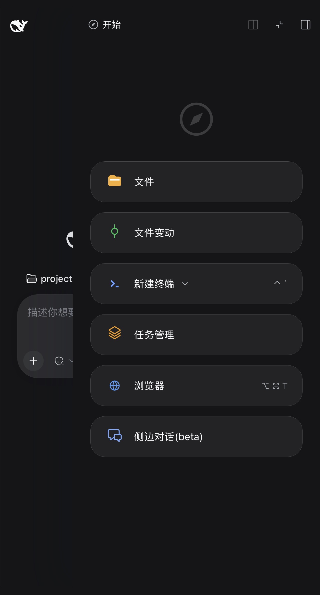

<h1 align="center">dsh-on-phone</h1>

<p align="center"><b>Use the DeepSeek Harness on your computer, from your phone.</b></p>

<p align="center">Install Tailscale on both devices and sign them in to the same account, then open the computer's address in a phone browser. Beyond Tailscale there is nothing else to install on either side — no dedicated app, no QR code, no login page.</p>

<p align="center">
  <a href="https://github.com/JauLukNgai/dsh-on-phone"></a>
  <a href="LICENSE"></a>
  <a href="package.json"></a>
  <a href="#supported-dsh-versions"></a>
  <a href="#quick-start"></a>
</p>

<p align="center">
  <a href="#features">Features</a> ·
  <a href="#quick-start">Quick start</a> ·
  <a href="#when-this-is-not-the-right-fit">Not a fit</a> ·
  <a href="#security">Security</a> ·
  <a href="TROUBLESHOOTING.md">Troubleshooting</a> ·
  <a href="CHANGELOG.md">Changelog</a> ·
  <a href="README.md">中文</a>
</p>

<p align="center">
  
  
  
</p>

## Features

- **One DSH, two screens** — The session list, the workspaces, the message history and the model you picked are one and the same on both devices; a message sent from either side appears on the other at once. The interface is the one on the computer itself, with the buttons, drawer and composer sized for fingers.
- **Your data stays on your own link** — The two devices connect peer to peer; the plugin opens no account system, introduces no relay service, and uploads nothing. Access is decided by your own Tailscale network.
- **Any computer, any phone** — macOS, Windows and Linux on the computer; iOS and Android alike on the phone, needing nothing but a browser that opens web pages.
- **Enable it and it works, with nothing to configure on the phone** — Turn it on in the DSH panel and copy the address into the phone browser. No pairing, no account to sign into on the phone, no second app to install there.

## Quick start

### 1 · Put the computer and the phone in one tailnet

This step installs Tailscale's own connectivity client — [download it here](https://tailscale.com/download) — which is not the same thing as this plugin.

- **Computer** — install the desktop app and sign in.
- **Phone** — install it from the App Store or [Google Play](https://play.google.com/store/apps/details?id=com.tailscale.ipn), sign in with the **same account**, then flip the switch to connect: iOS asks once to add a VPN configuration and Android asks once to allow a VPN connection. Both have to be accepted. The phone is ready when it shows as connected.

  If the phone has a custom DNS configured (NextDNS, AdGuard and the like), set it back to automatic, or the plugin's address will not open. See [TROUBLESHOOTING.md](TROUBLESHOOTING.md#4-远程通道显示-ready-但不可达) for the exact setting.

Once both are connected they should see each other in the device list. On different accounts? Share the computer's node with them under [Machines](https://login.tailscale.com/admin/machines).

### 2 · Open two switches on your tailnet

Both live on the admin console's [DNS page](https://login.tailscale.com/admin/dns):

| Switch | What happens without it |
| --- | --- |
| **MagicDNS** | The phone cannot resolve the computer's address, so the page will not open. |
| **HTTPS Certificates** | No HTTPS certificate can be issued, so **enabling remote access fails**. On failure the panel shows only a generic message and will not name this switch — if enabling fails for no obvious reason, come back and check it. |

### 3 · Install the plugin on the computer

Two ways to install, pick one:

**1. From npm** (recommended)

```bash
dsh plugin --profile web add dsh-on-phone@latest
```

Desktop needs no command — put the package name `dsh-on-phone` in **Add plugin**.

**2. From source** (to edit the code or pin a commit; Node `^22.19.0 || >=24.0.0` required)

```bash
git clone https://github.com/JauLukNgai/dsh-on-phone.git && cd dsh-on-phone
npm ci && npm run build && npm pack
```

The last command prints the full path of `dsh-on-phone-<version>.tgz`.

Whichever you picked, then pick the DSH you are running:

**DSH Desktop** — open **Plugins** in the sidebar → **Add plugin**: for the npm route put the package name `dsh-on-phone`, for the source route paste that tgz path. Click **Install**, then click **Enable now**. Desktop manages its own plugins; the command line cannot do it — `dsh plugin --profile desktop` is refused outright.

**DSH CLI** — for the npm route use the first command; for the source route run `cd dsh-on-phone` first, then:

```bash
dsh plugin --profile web add "$PWD/$(ls -1 dsh-on-phone-*.tgz | sort -V | tail -1)"
```

`web` is the profile `dsh web` uses; swap the name if you run a different one.

<details>
<summary>Want a newer version?</summary>

Plugins do not update themselves, so remove and reinstall: on Desktop open **dsh-on-phone** in the Plugins panel and click **Uninstall**, then install once more the way you chose above (the package name for the npm route, the new tgz for the source route); on the CLI run `dsh plugin --profile web remove dsh-on-phone` and then `add`.

Installing the same version again is skipped; uninstall it and install once more.

If nothing shows up afterwards, **quit and reopen** DSH — the plugin runs inside the host and cannot be hot-swapped.
</details>

### 4 · Enable remote access on the computer

Open the **Mobile access** panel at the bottom left of DSH and click **Enable remote access**. The panel shows an address of its own (one ending in `.ts.net`) — click **Copy address** and send it to your phone.

### 5 · Open it on the phone

Open that address in the phone's browser and you are looking at this DSH on your computer.

Keep DSH running on the computer: the phone talks to the instance that is running there. After this, the phone only needs Tailscale to be connected.

**Diagnostics** runs a self-check and produces a copyable report, and **Reconnect** starts over when the connection misbehaves. Both are available on the computer only — the phone cannot reach them.

## When this is not the right fit

- **The phone cannot run Tailscale** — the phone and the computer have to be in the same tailnet.
- **You want public access from anywhere** — this is a private network, not a public tunnel, and both `Funnel` and port forwarding are ruled out on purpose — they void the access control.
- **You want someone else to reach your computer from a phone** — every device that can open the address counts as a fully trusted operator that may read configuration and run tools, so this is for your own devices.
- **The computer cannot stay on** — the phone talks to the DSH that is running on it.
- **You want to share a session with someone** — DSH Web's own sharing link opens on a phone too, but this channel serves the devices in your tailnet.

## Security

- **Only devices in your tailnet can reach it.** Keep that list to devices you trust.
- **Never enable Tailscale Funnel**, and do not expose the address through port forwarding — that would defeat the access control entirely. Turn the panel switch off when you are not using it.
- Known limitation: DSH's own page security policy allows inline scripts. This plugin does not introduce that risk and cannot remove it at this layer.

The full threat model is in [SECURITY.md](SECURITY.md).

## Troubleshooting

The full handbook is [TROUBLESHOOTING.md](TROUBLESHOOTING.md). The three most common cases:

- **The phone cannot open the address** — Check that Tailscale is running on the phone and signed into the same account as the computer, and that you are opening the address shown in the panel (not `localhost`). Then re-check the two switches in [Quick start](#quick-start), step 2. If Tailscale says it is connected and the address works over the IP but not over the hostname, it is the phone's DNS setting — see [§4](TROUBLESHOOTING.md#4-远程通道显示-ready-但不可达) in the handbook.
- **The panel says ready, but the address does not load** — Click **Reconnect** first. If the panel reports a port conflict, something else on the computer already holds port 443 (for example another `tailscale serve` you configured yourself); see [§4](TROUBLESHOOTING.md#4-远程通道显示-ready-但不可达) in the handbook.
- **The page layout is broken** — Temporarily append `?frontend=stock` to the address to load DSH's stock page, with no phone adaptation at all; that tells you which layer the problem is in.

## Supported DSH versions

Verified against the prerelease line from `0.1.0-rc.5` through `0.2.0-rc.2`; the full list is the peerDependencies in [package.json](package.json). Installing successfully but producing "no reaction at all" usually means the version gate — see [Troubleshooting](#troubleshooting).

## Contributing

Issues and pull requests are welcome — see [CONTRIBUTING.md](CONTRIBUTING.md).

## Uninstall

On Desktop, open **dsh-on-phone** in the Plugins panel and click **Uninstall**. On the command line:

```bash
dsh plugin --profile web remove dsh-on-phone              # remove the plugin only
dsh plugin --profile web exec dsh-on-phone purge --yes    # also delete $DSH_HOME/mobile-access/
```

`purge` deletes `$DSH_HOME/mobile-access/` entirely — configuration, custom CSS/JS and extensions all live there. After uninstalling on Desktop, delete that directory by hand for the same effect.

## License and credits

Apache-2.0, see [LICENSE](LICENSE). The project began as a fork of [dsh-mobile](https://github.com/saya-ch/dsh-mobile); host and client implementations have since been rewritten, and the remote channel is built on [Tailscale Serve](https://tailscale.com/kb/1242/tailscale-serve).
