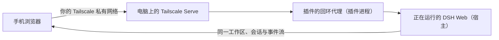

# 排障手册

本文件记录 DSH on Phone 在真实环境中出现过的故障、根因和处置方式。每一条都来自实际发生的现场日志，不是推测。

适用对象：DeepSeek Harness 桌面端（macOS / Windows；旧应用名是 DSH Desktop）与通过 `dsh plugin` 安装的 web profile。

> **应用名与绝对路径**：旧版桌面端是 `/Applications/DSH Desktop.app`，实现解包在 `Contents/Resources/app/node_modules/...`；当前版本是 `/Applications/DeepSeek Harness.app`，实现收进 `Contents/Resources/app.asar`（`Contents/Resources/app/` 目录不存在）。下面少数命令保留了旧版的 app bundle 绝对路径，它们**只在旧版本上可用**；当前版本请用 profile 闭包里的符号链接、`$DSH_HOME` 下的路径，或 README 安装一节里 `npm install -g @deepseek-ai/dsh@0.2.0-rc.2` 装出的 `dsh` CLI。

## 快速分诊

| 现象 | 跳到 |
| --- | --- |
| DSH Desktop 启动后所有第三方插件都不见了（进入 Safe Mode） | [1](#1-dsh-desktop-进入-safe-mode) |
| `dsh plugin ... add` 报 `ERR_PNPM_UNEXPECTED_STORE` | [2](#2-err_pnpm_unexpected_store) |
| 插件报 `unsupported DeepSeek Harness version` | [3](#3-unsupported-deepseek-harness-version) |
| 远程面板显示 `ready`，但手机打不开地址 | [4](#4-远程通道显示-ready-但不可达) |
| 日志刷 `TimeoutOverflowWarning` / `upstream_unavailable` | [5](#5-timeoutoverflowwarning--upstream_unavailable) |
| 插件安装时报 `resolves outside the installation closure` | [6](#6-resolves-outside-the-installation-closure) |
| 手机端「设置 → 模型」报 `settings are unavailable in this browser`、会话里选不了模型 | [10](#10-手机端设置与模型不可用) |
| 点开菜单（模型列表、会话行的三个点）却自己关掉或跳转走 | [11](#11-点开的菜单被自己关掉) |

## 0. 先确定日志与状态位置

```bash
# DSH_HOME（桌面版）
export DSH_HOME="${DSH_HOME:-$HOME/.dsh}"

# 日志（最重要的证据来源；先看这两个目录，文件名随版本变化）
ls -la "$DSH_HOME/logs/" "$HOME/Library/Logs/DeepSeek Harness/"
LOG="$DSH_HOME/logs/desktop-next.log"

# 插件状态目录
ls -la "$DSH_HOME/mobile-access/"

# 最近的启动边界，用来把日志按"本次启动"切片
grep -n "^\[desktop\] starting" "$LOG" | tail -5
```

判断任何问题之前，**先把日志按最后一次 `[desktop] starting` 切开**再 grep，否则会被历史日志误导（本仓库就踩过这个坑：一次早已修复的旧报错被当成当前故障）。

## 0.5 一次请求经过哪几层

排障前先认清链路，后面每一条都能对上其中某一段；**除手机浏览器之外，其余全部跑在你自己的电脑上**：



| 层 | 挂了会看到什么 | 对应章节 |
| --- | --- | --- |
| 手机浏览器 | 页面打不开、白屏、排版错乱 | [4](#4-远程通道显示-ready-但不可达)、[10](#10-手机端设置与模型不可用)、[11](#11-点开的菜单被自己关掉) |
| Tailscale（手机侧 + 电脑侧） | 只有域名不通、用 IP 通；或面板显示 `ready` 却不可达 | [4](#4-远程通道显示-ready-但不可达) |
| Tailscale Serve（电脑侧映射） | 启用远程访问失败、443 被别的服务占着 | [4](#4-远程通道显示-ready-但不可达)、[15](#15-远程通道在-tailscale-上跑哪些命令) |
| 插件的回环代理 | 上游不可达、超时、请求体过大 | [5](#5-timeoutoverflowwarning--upstream_unavailable) |
| DSH 宿主与 profile 闭包 | 插件不加载、进入 Safe Mode、依赖解析失败、版本门禁 | [1](#1-dsh-desktop-进入-safe-mode)、[2](#2-err_pnpm_unexpected_store)、[3](#3-unsupported-deepseek-harness-version)、[6](#6-resolves-outside-the-installation-closure) |

## 1. DSH Desktop 进入 Safe Mode

**现象**：启动后左下角没有「移动访问」等第三方插件，日志出现：

```
[desktop] safe mode: third-party web profile bundles are blocked
```

**根因**：Safe Mode 本身**不是**一个持久化开关，而是"插件树加载失败"之后的兜底启动。只要**任意一个**插件在 `apply()` 阶段抛错，cordis 的加载器就会把整棵插件树判为失败：

```
[harness-node] plugin failures: {"stage":"apply", ..., "message":"<插件抛出的错误>"}
[harness-node] DSH entry failed: dsh: plugin tree failed to load: failed to apply loader entry <entry> (<package>): <错误>
[desktop] Harness entry failed during startup; stopping immediately
[desktop] plugin recovery detection: <package>
[desktop] safe mode: third-party web profile bundles are blocked
```

**所以：一个插件的错误会拖垮宿主，并连带停掉所有其他第三方插件。** 这也是本插件把版本检查从"抛错"改成"告警"的原因。

**判定命令**：

```bash
# 谁把整棵树弄挂了
grep -n "plugin tree failed to load" "$LOG" | tail -3

# 是否被持久化锁强制进入（而不是插件失败）
grep -c "Profile recovery requires Safe Mode" "$LOG"    # 0 = 不是锁导致的

# 确认是不是我们的插件
grep -n "mobile-access (dsh-on-phone)" "$LOG" | tail -3
```

**处置**：

1. 从日志里读出抛错的那个插件包名。
2. 按对应章节修（版本类见 [3](#3-unsupported-deepseek-harness-version)）。
3. 想先恢复其他插件：把肇事插件从 profile 摘掉（见 [7](#7-从-profile-摘除一个插件)），然后重启 DSH Desktop。**不需要**手动退出 Safe Mode —— 它只是内存标记，下次启动会正常走 `web` profile。

## 2. `ERR_PNPM_UNEXPECTED_STORE`

**现象**：在终端执行 `dsh plugin --profile web add ...` 失败：

```
ERR_PNPM_UNEXPECTED_STORE  Unexpected store location
```

**根因**：**pnpm 大版本不一致**。profile 的 `node_modules/.modules.yaml` 记录了它被哪个 store 链接：

```bash
grep -E "storeDir" "$DSH_HOME/profiles/web/node_modules/.modules.yaml"
# 例如： "storeDir": "/Users/<you>/Library/pnpm/store/v10"
```

DSH Desktop 内置的 pnpm 与终端 PATH 上的 pnpm 可能是不同版本（本机实测：应用内置的 `runtime/pnpm/bin/pnpm.cjs` 是 **11.7.0**，Homebrew 的 `pnpm` 是 **11.24.0**）。store 大版本不一致时（例如一边写 `store/v11`，而 `node_modules` 链的是 `store/v10`）pnpm 会直接拒绝操作。

**判定命令**：

```bash
which -a pnpm
pnpm --version    # 终端用的版本
# 应用内置的版本（当前版本没有 .desktop-bin shim，直接调 app bundle 里的运行时）：
APP="/Applications/DeepSeek Harness.app/Contents/Resources/runtime"
"$APP/primary-runtime/dependencies/node/bin/node" "$APP/pnpm/bin/pnpm.cjs" --version
```

**处置**：**始终用 DSH Desktop 自带的 pnpm**，别用终端 PATH 上那个：

```bash
# 当前版本：
APP="/Applications/DeepSeek Harness.app/Contents/Resources/runtime"
pnpm() { "$APP/primary-runtime/dependencies/node/bin/node" "$APP/pnpm/bin/pnpm.cjs" "$@"; }
pnpm --version    # 确认与 profile 的 store 大版本一致
dsh plugin --profile web add /absolute/path/to/dsh-on-phone-x.y.z.tgz
```

> 旧版应用把 shim 放在 `$DSH_HOME/.desktop-bin`（本机没有这个目录，`runtime/bin/node` 那种包装脚本还依赖应用自己注入的 `$DSH_DESKTOP_NODE_EXECUTABLE`，所以在应用外直接跑不了）。profile 的增删仍然用 `dsh plugin`，不要手改 `node_modules`。

> ⚠️ **不要忽略伴随的另一条 WARN**：
>
> ```
> [WARN] The "pnpm" field in package.json is no longer read by pnpm.
>        The following keys were ignored: "pnpm.overrides".
> ```
>
> 这是 pnpm 11 才有的警告，说明 **`pnpm.overrides` 被忽略了**。而 DSH Desktop 的 generation 机制正是用它把插件指向本地 generation：
>
> ```json
> "pnpm": { "overrides": { "dsh-cost-meter": "link:../.generations/live/dsh-cost-meter+.../node_modules/dsh-cost-meter" } }
> ```
>
> 一旦 override 被忽略而安装继续跑下去，pnpm 会**改从 npm registry 抓取这些包来替换本地 generation 链接**，破坏 generation 投影体系。<br>
> `ERR_PNPM_UNEXPECTED_STORE` 往往只是碰巧先挡住了这次破坏 —— 它报错反而是好事。

**安装成功的标志**（这两行说明 generation 被正确保护）：

```
dsh-desktop pnpm runner: excluded N generation projection(s) from pnpm
dsh-desktop pnpm runner: restored N generation projection(s) after pnpm
```

**装完自查**：

```bash
python3 -c "
import json;d=json.load(open('$DSH_HOME/profiles/web/package.json'))
print(json.dumps(d.get('pnpm',{}), indent=1))          # 全部应为 link:
print(list(d['dsh']['desktop']['generationProjection']['plugins'].keys()))
"
```

## 3. `unsupported DeepSeek Harness version`

**现象**：升级 DSH Desktop 后插件不再加载，并触发 [1](#1-dsh-desktop-进入-safe-mode)：

```
... message":"unsupported DeepSeek Harness version 0.1.2-rc.1; supported versions: 0.1.0-rc.5, ..."
```

**根因**：插件的版本白名单没跟上新的 Host 版本。在前身 `dsh-mobile-tailscale` 里，这个判断曾在 `apply()` 第一行抛错，因此**直接导致整棵插件树加载失败 → Safe Mode**。

**版本号是怎么读出来的**：插件用 `createRequire` 解析 `@deepseek-ai/dsh-host-webserver/package.json`。而 profile 的闭包目录里是指向 app bundle 的符号链接：

```bash
ls -l "$DSH_HOME/profiles/node_modules/@deepseek-ai/dsh-host-webserver"
# -> /Applications/DSH Desktop.app/Contents/Resources/app/node_modules/@deepseek-ai/dsh-host-webserver
# 本机实际输出就是这个（旧版应用的路径）：应用改名成 DeepSeek Harness.app 之后，这条链接是悬空的 ——
# 解析不到就按下文返回 'unknown' 并放行。当前版本实现收在 Contents/Resources/app.asar 内，
# 没有 Contents/Resources/app/ 这个目录。
```

**符号链接指向 app 内部，所以 DSH Desktop 一升级，解析出的版本就跟着变。** 解析不到时返回 `'unknown'` 并被放行 —— 这就是"以前能用、升级后突然不能用"的原因。

**判定命令**：

```bash
# 当前实际解析到的版本
node --input-type=module -e "
import { createRequire } from 'node:module';
const req = createRequire('$DSH_HOME/profiles/web/node_modules/dsh-on-phone/lib/index.mjs');
try { console.log(req('@deepseek-ai/dsh-host-webserver/package.json').version) } catch { console.log('unknown') }
"

# 装好的插件是否接受它（激活期走内部告警路径，assert 仍可用于判定）
node --input-type=module -e "
import { assertSupportedDshVersion } from '$DSH_HOME/profiles/web/node_modules/dsh-on-phone/lib/index.mjs';
try { assertSupportedDshVersion('<解析到的版本>'); console.log('放行') } catch (e) { console.log('拒绝:', e.message) }
"
```

**处置**：升级插件到已覆盖该版本的新版。若新版本尚未发布，见 [7](#7-从-profile-摘除一个插件) 先摘除以免拖垮宿主。

> **设计约定（勿回退）**：激活期遇到未验证版本只应**告警并继续**（`DSH_ON_PHONE_UNVERIFIED_DSH_VERSION`），不得抛错。抛错会把宿主的插件树一起弄挂。

## 4. 远程通道显示 `ready` 但不可达

面板显示就绪、地址也拿到了，但手机打不开。

远程地址是**机器级全局**的 `tailscale serve` 配置，不是进程级的，所以会被别处影响 —— 这是下面 A、B 两个成因。第三个不在电脑上，而在手机的 DNS 设置里。

**成因 A：30 天定时器溢出**（见 [5](#5-timeoutoverflowwarning--upstream_unavailable)）。

**成因 B：别的程序在抢 443**。同一台机器上任何另一套系统的 `tailscale serve` 都会互相覆盖；本插件在启动时若检测到 443 被占用且 443 是唯一 serve 条目，会执行 `tailscale serve reset` 来自愈 —— 这会连带清掉对方的配置。

**判定命令**：

```bash
tailscale serve status
tailscale serve status --json          # TCP.443.HTTPS 应为 true，且 / 指回插件的回环代理端口
tailscale status --json | python3 -c "import json,sys;d=json.load(sys.stdin);print(d['Self']['DNSName'])"
lsof -nP -iTCP:443 -sTCP:LISTEN
```

健康时的样子（代理端口是插件的 `RemotePassthroughProxy`，随机分配）：

```
https://<machine>.<tailnet>.ts.net (tailnet only)
|-- / proxy http://127.0.0.1:65179
```

**端到端验证**（最可靠，不要在插件面板里下结论）：

```bash
curl -s -o /dev/null -w "%{http_code}\n" https://<machine>.<tailnet>.ts.net/
# 200 = 通；000 = 不通
```

**处置**：确认没有第二套系统在管理 443；再用上面的 curl 判定。`(tailnet only)` 表示未暴露到公网。

**成因 C：手机上的 DNS 设置绕开了 Tailscale**（地址本身是好的，与 A、B 无关）。

症状很好认：手机上 Tailscale 显示已连接，用服务器的 Tailscale IP 也能通，但**只要换成域名就打不开**。原因是域名解析没走 Tailscale —— 手机上配过自定义 DNS 服务（NextDNS、AdGuard、1.1.1.1 这类）时，DNS 查询会被它截走。Tailscale 已知此问题且尚未修复（[tailscale#12563](https://github.com/tailscale/tailscale/issues/12563)；Android 对应 [tailscale#915](https://github.com/tailscale/tailscale/issues/915)）。

**处置**，先试第一条：

1. 把手机上的自定义 DNS 关掉：
   - iOS：设置 → 通用 → VPN 与设备管理 → **限制与代理** → DNS，改成「自动」
   - Android：设置 → 网络和互联网 → **私人 DNS**，改成「自动」
2. 顺带确认 iPhone 上 Tailscale App 里 Settings → DNS Settings → **Use Tailscale DNS Settings** 是开着的（相当于桌面端的 `--accept-dns`）。
3. 想让 Tailscale 统一接管所有设备的解析：管理后台 DNS 页的 **Nameservers** 里先加一个公共 DNS（比如 `1.1.1.1`），加完之后同一张卡片上才会出现 **Override local DNS** 开关，打开它。**没配过 nameserver 的 tailnet 上看不到这个开关**，这是它不出现的原因。

## 5. `TimeoutOverflowWarning` / `upstream_unavailable`

**现象**：

```
(node:NNNN) TimeoutOverflowWarning: 2592000000 does not fit into a 32-bit signed integer.
Timeout duration was set to 1.
[dsh-on-phone] remote proxy request failed for GET /mobile-access/extensions/manifest: upstream_unavailable (socket hang up)
[dsh-on-phone] mobile frontend route failed for GET /mobile-access/health: not_found
```

**根因**：远程免配对 guest 授权使用 **30 天**过期（`2_592_000_000 ms`），而 `setTimeout` 的上限是 **`2^31-1 ms` = 2_147_483_647 ms ≈ 24.85 天**。超出的延迟会被**静默截断成 1 ms**，于是每个远程请求和 WebSocket 都被立刻中止。

所有由会话过期时间派生的延迟都统一 clamp 到 `MAX_TIMER_DELAY_MS`。

**判定命令**（注意按最后一次启动切片，历史日志会有大量旧记录）：

```bash
python3 - <<'PY'
import re
# 旧版应用写 ~/Library/Logs/DSH Desktop/harness.log（本机最后一次写入是 2026-09-13）；
# 当前版本写 $DSH_HOME/logs/desktop-next.log 与 ~/Library/Logs/DeepSeek Harness/crash-*.log，
# 但下面这两个标记（[desktop] starting / TimeoutOverflowWarning）只在旧日志里出现过。
s = open("/Users/<you>/Library/Logs/DSH Desktop/harness.log", encoding="utf8", errors="replace").read()
tail = s[s.rfind("[desktop] starting"):]
print("本次启动 TimeoutOverflowWarning:", len(re.findall(r"TimeoutOverflowWarning", tail)))
print("本次启动 2592000000:", len(re.findall(r"2592000000", tail)))
PY
```

**处置**：升级本插件到最新版。修复后本次启动应为 **0 / 0**。

> 附带说明：`/mobile-access/health` 在远程路径返回 404 是预期的 —— 远程镜像只提供 `metadata`、`mobile-layout.js`、`custom.css` 与扩展清单。

## 6. `resolves outside the installation closure`

**现象**：DSH Desktop 的 generation 迁移失败：

```
[desktop] migration failed, restoring the pre-upgrade profile: <plugin> failed peer validation:
    @deepseek-ai/cordis resolves outside the installation closure: /Applications/DSH Desktop.app/...
[desktop] profile maintenance frozen: migration deferred (...)
```

**背景**：DSH Desktop 把所有 `@deepseek-ai/*` 与 `react` 视为**宿主单例**，安装 generation 时会**强制从 generation 内删除**它们，再要求它们能从"安装闭包"（`$DSH_HOME/profiles/node_modules`）解析到。

**重要**：这一类报错**很可能来自旧版安装器**。新版安装器的 `fallbackRoot` + `isInsideDirectory` 已能正确接受经由 profile 闭包符号链接解析进 app bundle 的宿主单例。

**路径**：上面报错里的 `/Applications/DSH Desktop.app/...` 是旧版应用；当前版本是 `/Applications/DeepSeek Harness.app`，实现收在 `Contents/Resources/app.asar` 内。

**判定命令**：直接调用 DSH 自己的校验器，不要凭日志下结论：

```bash
H="$DSH_HOME"; PROBE="$H/profiles/.generations/staging/verify-probe"
P="$H/profiles/web/node_modules/dsh-on-phone"
rm -rf "$PROBE"; mkdir -p "$PROBE/node_modules"
cp -R "$P" "$PROBE/node_modules/dsh-on-phone"
node --input-type=module -e "
const { verifyGenerationPeers } = await import('/Applications/DSH Desktop.app/Contents/Resources/app/node_modules/dsh-desktop-market-installer/generations/installer.mjs'); // 旧版路径：当前版本同一模块收在 app.asar 里，普通 node 无法 import —— 这条探针只能在旧版应用上原样跑
const r = await verifyGenerationPeers('$H', { directory: '$PROBE', pluginName: 'dsh-on-phone', version: 'x.y.z' });
console.log('ok =', r.ok); console.log(r.problems.join('\n'));
"
rm -rf "$PROBE"
```

**如何解读**：探针目录没有真实 `pnpm install`，所以普通依赖（及其传递依赖）会逐层报 `does not resolve` —— **这是探针产物，不是真实故障**。真正要看的是 `@deepseek-ai/*` 与 `react`：它们出现在 `problems` 里才是真问题。真实的 generation 里 pnpm 会把普通依赖装进 generation，这些报错不会出现。

**处置**：若 `@deepseek-ai/*` / `react` 已不在 `problems` 中，**不要改 `peerDependencies`** —— 在已验证可用的清单上做投机改动只会引入新风险。

## 7. 从 profile 摘除一个插件

当某个插件正在拖垮宿主（[1](#1-dsh-desktop-进入-safe-mode) / [3](#3-unsupported-deepseek-harness-version)）而你想先保其他插件时。

**用官方命令**，它会同时跑 `pnpm remove` 并让 `dsh.profile.bundles` 与安装状态重新对齐：

```bash
export PATH="$DSH_HOME/.desktop-bin:$PATH"     # 旧版应用生成的 shim 目录；本机不存在，缺了就直接用下面的 CLI
dsh plugin --profile web remove <package-name>
# dsh 不在 PATH 时用 Desktop 内置 CLI（旧版应用，实现解包在 app bundle 内）：
# node "/Applications/DSH Desktop.app/Contents/Resources/app/node_modules/@deepseek-ai/dsh/lib/bin.js" \
#      plugin --profile web remove <package-name>
# 当前版本（/Applications/DeepSeek Harness.app）把实现收进 Contents/Resources/app.asar，上面这条绝对路径
# 不存在；改用 README 安装一节的 CLI：
#   npm install -g @deepseek-ai/dsh@0.2.0-rc.2 && dsh plugin --profile web remove <package-name>
```

**先备份**：

```bash
BK="$DSH_HOME/recovery/plugin-removals/manual-$(date -u +%Y%m%dT%H%M%SZ)"
mkdir -p "$BK"
for f in package.json pnpm-lock.yaml cordis.patch.yml pnpm-workspace.yaml; do
  cp -p "$DSH_HOME/profiles/web/$f" "$BK/$f"
done
```

**摘除后自查**：

```bash
python3 -c "
import json;d=json.load(open('$DSH_HOME/profiles/web/package.json'))
deps=d['dependencies']; bundles=d['dsh']['profile']['bundles']
print('deps:', list(deps)); print('bundles:', bundles)
print('已摘除:', '<package-name>' not in deps and '<package-name>' not in bundles)
"
grep -c "<package-name>" "$DSH_HOME/profiles/web/pnpm-lock.yaml"   # 应为 0
```

然后重启 DSH Desktop 即可脱离 Safe Mode。

## 8. 健康检查清单

手机功能出问题时，按顺序跑完这五项再下结论：

```bash
# 1) 插件在 profile 里且已加载
grep -n "DSH entry loaded" "$LOG" | tail -1

# 2) 插件自报的远程状态（<web-port> 用 DSH WebServer 的端口）
curl -s -H "Host: 127.0.0.1" http://127.0.0.1:<web-port>/api/mobile-access/remote/control
# 期望：{"provider":"tailscale","running":true,"state":"ready","origin":"https://...ts.net/"}

# 3) 远程 443 归属
tailscale serve status --json

# 4) 远程端到端
curl -s -o /dev/null -w "remote %{http_code}\n" https://<machine>.<tailnet>.ts.net/

# 5) 本次启动无定时器溢出
python3 -c "
import re;s=open('$LOG',encoding='utf8',errors='replace').read()
t=s[s.rfind('[desktop] starting'):];print('TimeoutOverflowWarning:', len(re.findall('TimeoutOverflowWarning', t)))
"
```

期望：`DSH entry loaded` / `state: ready` / `TCP.443.HTTPS = true` / `remote 200` / `TimeoutOverflowWarning: 0`。

更轻的一条端到端检查是直接取手机端资源（应当返回一段含 `pluginVersion` 的 JSON）：

```bash
curl -s https://<machine>.<tailnet>.ts.net/mobile-access/metadata
```

> `/mobile-access/health` 在远程路径上返回 404 是**预期结果**：那个端点只存在于插件自己的网关监听器上，远程镜像不提供它，不是故障。

## 9. 卸载与数据清理

```bash
dsh plugin --profile web exec dsh-on-phone purge --yes
dsh plugin --profile web remove dsh-on-phone
```

`purge` 删除 `$DSH_HOME/mobile-access/`（设置、配对设备表 `devices.json`、自定义文件与扩展）。其中 `devices.json` 存的是配对设备的令牌摘要，外发或打包前请先清除。Tailscale 的登录状态**不在这里** —— 本插件只调用你自己安装的 `tailscale` 二进制（`serve` / `status`），凭据始终留在那套安装自己的目录里，插件既不读取也不写入。

## 10. 手机端设置与模型不可用

**现象**：手机（tailnet）上「设置 → 模型」报 `settings are unavailable in this browser` / `加载提供方目录失败`，会话里的模型选择器也拿不到模型列表。桌面端一切正常。

**根因**：DSH 在插件激活时**只读一次**宿主信任提示来决定设置后端（`ctx.remote.$host.isLoopback ? "host" : "memory"`）。取值是 `memory` 时就没有宿主支持的设置面，模型目录随之加载失败。

手机页要拿到 `host`，必须满足两件事，缺一不可：

1. 页面带有本插件注入的信任标志（`window.__DSH_ON_PHONE_TRUSTED_GATEWAY__`），客户端才会把 `connection.isLoopback` 置真。
2. **启动清单里 settings 模块的 `inject` 必须包含本插件**，本插件才会先于 settings 激活。

第 2 条由 `orderAuthenticatedSettings` 写入。它曾用一个写死的模块 id（旧名 `dsh-mobile`）去清单里找自己，而清单里的条目 id 是**包名**（现在是 `dsh-on-phone`）：找不到就 `return`，于是这段排序**静默失效**，客户端与宿主都没有任何报错。测试夹具当时也用了同一个过时 id，所以测试全绿而线上失效。

同一处还有第二个漂移：它要求 settings 模块的 `inject` 含 `@deepseek-ai/dsh-client-connection`，而 DSH 0.1.2 的 settings 只声明 `@deepseek-ai/dsh-api-remotes`——**只修 id 会让它抛错并把移动端首页整体 502**，两处必须一起改。

**判定命令**：直接对运行时首页跑一遍改写，看 settings 的 `inject` 有没有被追加：

```bash
node --input-type=module -e "
import { rewriteMobileIndex } from '$DSH_HOME/profiles/web/node_modules/dsh-on-phone/lib/index.mjs'
import { readFileSync } from 'node:fs'
const out = rewriteMobileIndex(readFileSync('/tmp/dsh-index.html','utf8'))
console.log(out.includes('\"inject\":[\"@deepseek-ai/dsh-api-remotes\",\"dsh-on-phone\"]') ? '排序已生效' : '排序未生效')
"
```

`/tmp/dsh-index.html` 可以直接抓：`curl -s https://<machine>.<tailnet>.ts.net/ > /tmp/dsh-index.html`。

**远程通道另有独立成因**：远程由回环直通代理服务，它必须自己对首页做同样的改写（`rewriteRemoteMobileIndex`）。该改写曾以 `Content-Length` 为前置条件，而 DSH 用 `Transfer-Encoding: chunked` 返回首页 → **每次请求都跳过改写**，远程通道上这套修复等于没生效。所以远程排查时，要确认改写真的执行了，而不是只看面板状态。

**处置**：升级本插件到最新版。若升级后远程仍失败，看启动日志里有没有 `remote proxy served the stock document: ...` —— 那是改写被跳过的证据。

## 11. 点开的菜单被自己关掉

**现象**：两个不同的表现，根因都在本插件的 stock 面适配层（`native-mobile.ts`）：

- 会话里点底部模型控件 → 点「模型」那一行 → **弹窗直接关掉**（而「推理等级」那一行正常）。
- 会话/项目行点「三个点」→ 选项闪一下 → **侧边栏收起 / 看着像跳进了会话**。

**根因一（模型菜单）**：DSH 的模型菜单是两级的，钻入「模型」层时会**自动聚焦搜索框**，而它的失焦处理会关掉整个弹窗：

```js
useEffect(() => { if (open && pane === "model") searchRef.current?.focus() }, [open, pane])
const onBlur = (event) => { if (rootRef.current?.contains(event.relatedTarget)) return; close() }
```

本插件有个守卫，本意是"会话打开时 DSH 会程序化聚焦 composer，手机上会弹 iOS 键盘"，但它当时会 blur **任何**非用户点出的聚焦字段——搜索框也是 `input`，于是被 blur → 焦点离开弹窗 → `onBlur` → 关闭。「推理等级」层没有搜索框，所以不受影响，这正是那个不对称的来源。守卫现已收窄为只管 composer 编辑器本身。

**根因二（行内三个点）**：竖屏"选中会话后自动收起侧边栏"的监听用 `closest('[role="treeitem"]')` 判断，把**行内任何点击**都当成选中该行，于是 240ms 后收起侧边栏，刚打开的 portal 菜单随之消失。现已要求点击落在行体上（行内按钮不算），与专属布局里本来就有的守卫一致。

**判定命令**：这两个都是本插件行为，不需要看宿主日志。若现象是"某个菜单点开即关"，先确认菜单里是否有自动聚焦的输入框——有，就是根因一这一类。

**处置**：升级本插件到最新版。

> **注意**：修复后钻入模型列表时**键盘会弹出**，因为 DSH 的设计就是自动聚焦那个搜索框（桌面版同样如此）。这是预期行为，不要为消除它再去 blur 该字段——那正是把弹窗关掉的原因。

---

## 12. 环境变量与调试开关

这些都不需要用户设置，只在默认行为不适用时才用得上。

| 环境变量 | 作用 |
| --- | --- |
| `DSH_ON_PHONE_TAILSCALE_BIN` | 指定 `tailscale` 可执行文件的路径。macOS 上 GUI 应用由 launchd 启动，继承的 PATH 很短（`/usr/bin:/bin:/usr/sbin:/sbin`），插件会依次去找 `/usr/local/bin/tailscale`、`/opt/homebrew/bin/tailscale`、`/Applications/Tailscale.app/Contents/MacOS/Tailscale`、`~/Applications/Tailscale.app/Contents/MacOS/Tailscale`，最后才回退到 PATH。装在别处就用这个变量指过去。 |
| `DSH_ON_PHONE_REMOTE_PROVIDER` | 远端提供方，目前只有 `tailscale` 一个合法值。旧拼写 `DSH_MOBILE_REMOTE_PROVIDER` 仍然接受。 |

URL 参数（加在手机端地址后面）：

| 参数 | 作用 |
| --- | --- |
| `?frontend=stock` | 让服务端跳过手机页改写，加载 DSH 原生页面，用来判断问题出在哪一层。 |
| `?dsh-on-phone-preview` | 在电脑浏览器里预览手机端的 DOM 适配层（旧拼写 `?dsh-mobile-preview` 仍然接受）。 |

## 13. 调试遥测通道

手机端有一条**只写不读**的调试通道 `/__dsh-on-phone/telemetry`，把页面加载耗时、卡住的请求与手势轨迹追加到 `$DSH_HOME/mobile-telemetry.jsonl`：单条上限 256 KiB、单文件上限 4 MiB（超出轮转到 `.1`），只记录 class 名与几何量，不记录文本与按键。它存在的原因是这些问题只发生在真机上。用完直接删掉该文件即可。

## 14. 插件配置项

键写在 profile 的 `cordis.patch.yml` 的 `mobile-access` 条目里（或插件管理器的配置面板），除 `stateFile` 外都可省略。

| 键 | 默认值 | 说明 |
| --- | --- | --- |
| `stateFile` | 必填 | 插件状态文件。随包的 `cordis.patch.yml` 已设为 `$DSH_HOME/mobile-access/devices.json`；自定义资源与扩展目录由它派生。 |
| `upstreamOrigin` | `http://127.0.0.1:3080` | 回环上游的**兜底**地址。DSH Desktop 每次启动都随机绑端口，所以插件优先跟随 host 侧 WebServer 的实际地址，其次是 `DSH_WEB_URL`，最后才用这里配的值。 |
| `maxActiveRequests` / `maxWebSockets` | `32` / `16` | 远程通道的并发请求与 WebSocket 上限。 |
| `maxBodyBytes` / `upstreamTimeoutMs` | `160 MiB` / `30000` | 请求体上限与上游超时（毫秒）。 |
| `customCssFile` / `customScriptFile` | `$DSH_HOME/mobile-access/mobile.css` / `mobile.js` | `/mobile` 与手工定制写入的文件。 |
| `mobileLayoutFile` | 随包的 `lib/mobile-layout.js` | 专用手机布局模块，通常不用改。 |

`listenHost` 在随包配置里固定为 `127.0.0.1`。其余运行时文件：`remote/control.json`（远程开关）、`remote/provider.json`（提供方）、`extensions/`（扩展）。

## 15. 远程通道在 Tailscale 上跑哪些命令

插件不安装 Tailscale、不替你登录、也不碰 Funnel —— 它只调用你自己那个 `tailscale` 二进制，一共六处：

| 时机 | 命令 | 读还是写 |
| --- | --- | --- |
| 启用远程时 | `serve --bg --yes --https=443 http://127.0.0.1:<插件代理端口>` | **写**：占用该节点唯一的 https:443 槽位 |
| 看门狗（5s 后首查，之后每 60s） | `serve status --json` | 只读：443 是否还指向本插件，不是就重注 |
| 关闭远程时 | `serve status --json` → `serve --https=443 off` | 先读后写：**确认 443 指向本插件**才撤 |
| 端口被占自愈时 | `serve status --json` → `serve reset` | 先读后写：**仅在 443 是唯一 serve 条目时**清空整份配置 |
| 取远程地址时 | `status --json` | 只读：读节点的 MagicDNS 名字 |

- **443 是机器级全局配置。** 同一台机器上任何另一套 `tailscale serve` 都与它互斥；启用插件会占用这个槽位，把它原来指向的目标换成插件自己的。反方向是有保护的：关闭插件时**不会**误删别人的条目 —— `off` 之前会先读一次状态，只有 443 仍指向本插件才撤。
- **不要开 Funnel。** 那会把服务暴露到公网，而本插件的访问控制完全建立在「只有 tailnet 成员连得上」这个前提上。

## 16. 兼容性门禁与适配层的脆性

未列入支持清单的 DSH 版本只会记一条告警并继续启动；从 DSH `0.2.0-rc.2` 起这条检查变成硬门禁：不兼容的 bundle 会被**跳过加载**（列入 `skippedBundles`），插件看起来「装了但没反应」。豁免记在 profile 的 `compatibility.json` 里，且**插件升级与 DSH 升级都不会继承它**，需要重新授权。

手机端的适配依赖 DSH 客户端的内部类名、`aria-label` 文案与 `data-*` 属性。上游改动这些名字时，对应的一小块修复会**静默失效**（页面照常打开，只是那一处退回桌面行为），由 `npm run check:dsh-compatibility` 在 CI 里对上游源码做契约检查。
